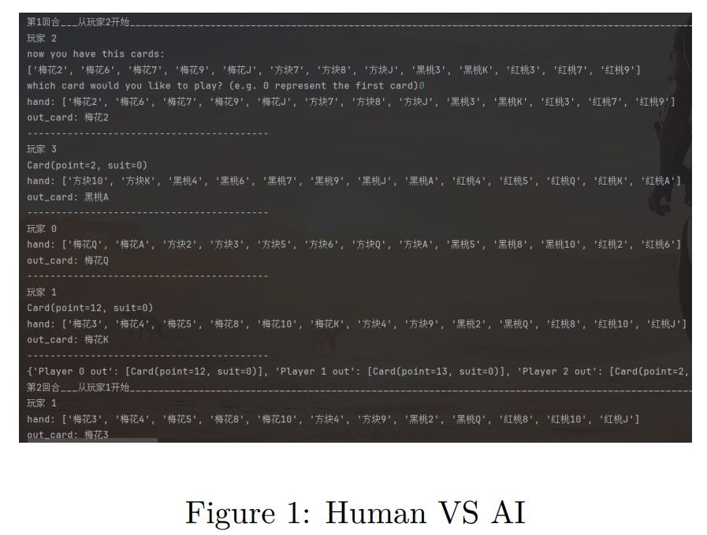
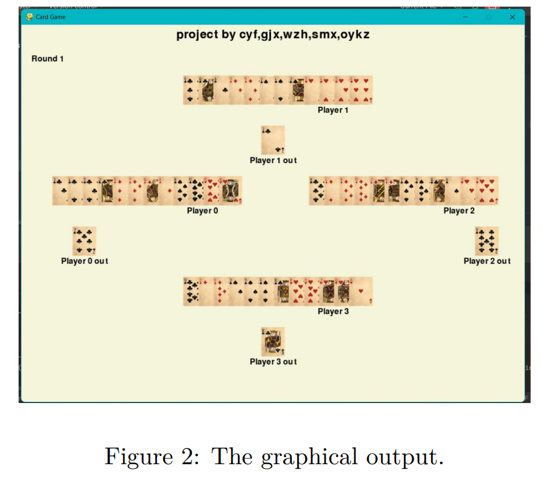
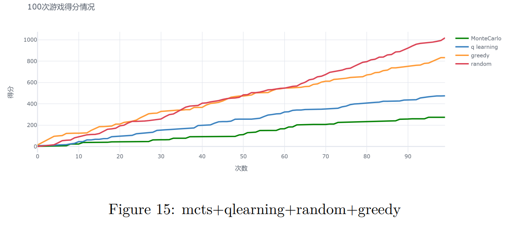

This is for my ShanghaiTech Artificial Intelligent Course final project

The main text of the paper can be found at:([final report.pdf](final%20report.pdf))

Due to the high difficulty of Hearts, it was challenging to find reference materials online. Our code framework was sourced from https://github.com/pjgao/MonteCarloHeartsAI , which is an unfinished codebase, only defined the rules of Hearts and provided a sample. It is crucial to note that the designed code does not adhere to the game rules. In other words, its decision design does not align with Hearts rules, resulting in incorrect card plays. The conclusions drawn from the original code are therefore not reliable. Nevertheless, it served only as a reference for understanding the game, and we made extensive modifications and debugging.

In addition to this, we independently made various contributions:

1. We reconstructed the Monte Carlo algorithm, incorporating Hearts rules into the algorithm to ensure correct card plays.

2. We expanded our algorithms to include Q-learning (core formula from class PPT), greedy (decision-making based on gaming techniques from BaiduBaike), and random (baseline for assessing algorithm performance). These three algorithms were applied to the other three players, enhancing opponent intelligence and increasing the difficulty of the game.

3. We implemented both text-based (terminal) and graphical (pygame) outputs. After each round, we printed the card plays and remaining hand information for each player in the terminal. Additionally, using the pygame library, we achieved a visualized graphical interface, enhancing the user experience (see Figure).

4. The original Monte Carlo assumes that all other players use the Monte Carlo algorithm by default. During the execution, we introduce hyperparameters that allow the algorithm to adjust based on the actual game. When leading by a significant margin in scores, it tends to assume that the opponents are using naive algorithms, with the aim of applying the concept of reinforcement learning, which estimates actual situations during the exploration process.

